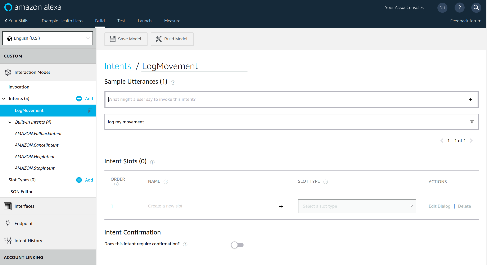
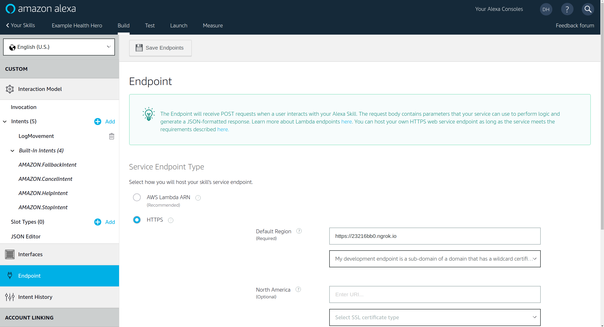
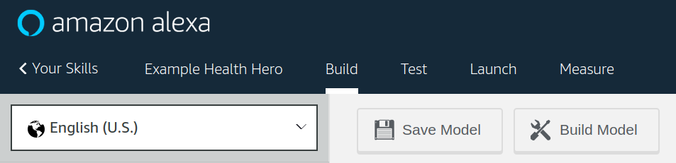

# Example Alexa Ruby/Sinatra app

* Goal
    * Create an Amazon Alexa skill that gets triggered when user says: "Alexa log a movement activity on Health Hero for 30 minutes"
    * Alexa should log the activity.

## Local Devlopment Server Setup
----

* Download and unzip [ngrok](https://ngrok.com/).

* Configure your firewall settings.

  * e.g.: allow on port 8080 for this example

* Start ngrok using the port specified

```bash
cd $MY_WORKSPACE/example_alexa_ruby_sinatra
ngrok http 8080
```

* Note the `Forwarding` address mapping
  * We'll need to use the `https://<subdomain>.ngrok.io` part later in the `Endpoint` configuration.

  * e.g.:

```
Forwarding                    https://03795abd.ngrok.io -> localhost:8080
```

* Clone this repo:
  * If you used a different port for ngrok, adjust the port specified by `set :port, 8080` in the repo's `lib/example_alexa_ruby_sinatra/server.rb` file accordingly.

```bash
cd $MY_WORKSPACE
git clone https://github.com/drhuffman12/example_alexa_ruby_sinatra.git
cd example_alexa_ruby_sinatra
```

* Start the app

```bash
cd $MY_WORKSPACE/example_alexa_ruby_sinatra
bin/server
```

## Alexa Skill Setup
----

### Log into your Alexa Dev account and add a skill.

https://developer.amazon.com/alexa

### Configuration

Under the "Build" tab for the skill, configure it with the following porperties

```yml
skill:
  - name: "Example Health Hero"
  - invocation_name: "example health hero"
  - type: "Custom"
  - endpoint:
    - type: "HTTPS"
    - regions:
        - default_region:
        - url: "https://23216bb0.ngrok.io"
        - cert_option: "My development endpoint is a sub-domain that ..."
  - intents:
    - name: "LogMovement"
    - utterances:
      - utterance: "log my movement"
```

See below example screenshots:








### Testing

Under the "Test" tab, go to the "Alexa Simulator" sub-tab and do the following:

- Select the language of your choice
- Click into the text box
- Make a request to Alexa in this format (or type the following and press enter): `ask <skill-name> <intent-utterance>`
  - e.g.: `ask Example Health Hero log my movement`

  - Alexa should respond with:
    - ""

  - If there is a problem, Alexa might respond with one of the below common problem responses. (Check in the `Device Log`. Click on `<timestamp> - Directive: SkillDebugger.CaptureError` or `<timestamp> - Directive: SkillDebugger.CaptureDebuggingInfo` and view the details.)

    - `There was a problem with the requested skill's response`
      - if your skill is configured properly and your request to Alexa was: `ask Example Health Hero log my movement`, but the response in your sinatra is not yet set up as Alexa is expecting

      -   

    - `<Audio only response>`
      - if it didn't understand at all
        - e.g.: if your request to Alexa was something like: `foo bar`

    - `Sorry, I'm not sure.`
      - if it didn't understand at all
        - e.g.: if your request to Alexa was something like: `ask foo bar`

## Development

After checking out the repo, run `bin/setup` to install dependencies. Then, run `rake spec` to run the tests. You can also run `bin/console` for an interactive prompt that will allow you to experiment.

To install this gem onto your local machine, run `bundle exec rake install`. To release a new version, update the version number in `version.rb`, and then run `bundle exec rake release`, which will create a git tag for the version, push git commits and tags, and push the `.gem` file to [rubygems.org](https://rubygems.org).

## Contributing

Bug reports and pull requests are welcome on GitHub at https://github.com/[USERNAME]/example_alexa_ruby_sinatra. This project is intended to be a safe, welcoming space for collaboration, and contributors are expected to adhere to the [Contributor Covenant](http://contributor-covenant.org) code of conduct.

## License

The gem is available as open source under the terms of the [MIT License](https://opensource.org/licenses/MIT).

## Code of Conduct

Everyone interacting in the ExampleAlexaRubySinatra project’s codebases, issue trackers, chat rooms and mailing lists is expected to follow the [code of conduct](https://github.com/[USERNAME]/example_alexa_ruby_sinatra/blob/master/CODE_OF_CONDUCT.md).
