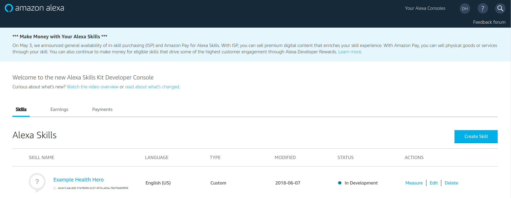
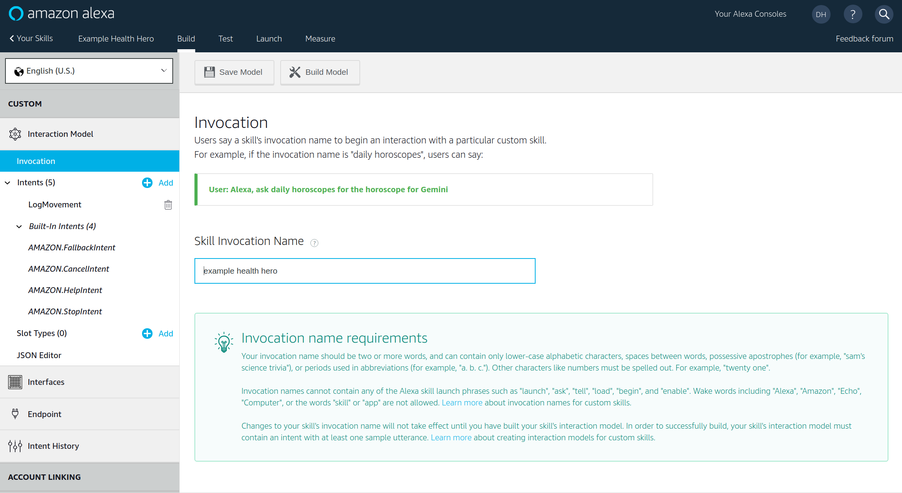
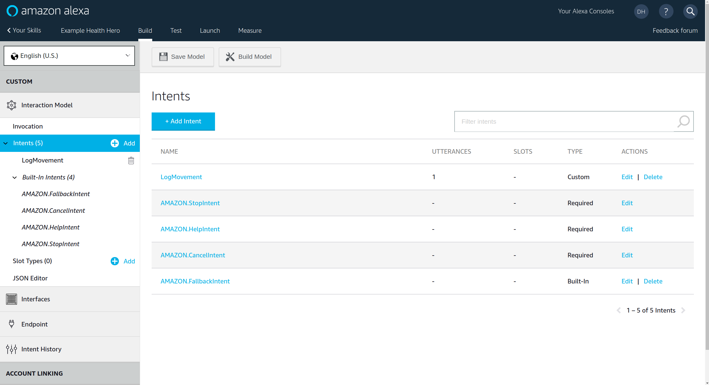
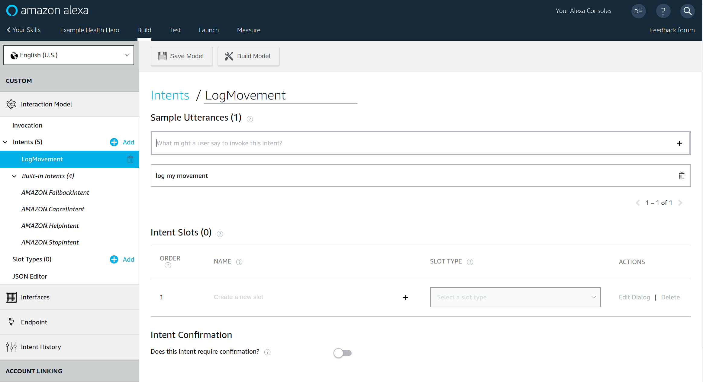
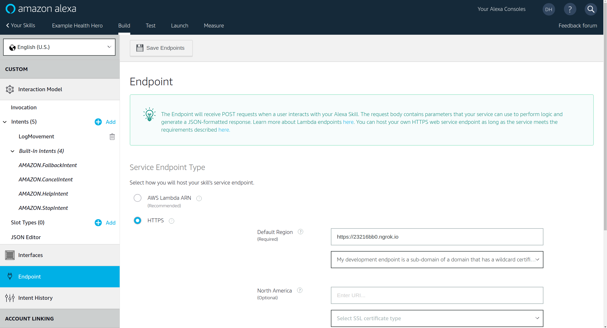
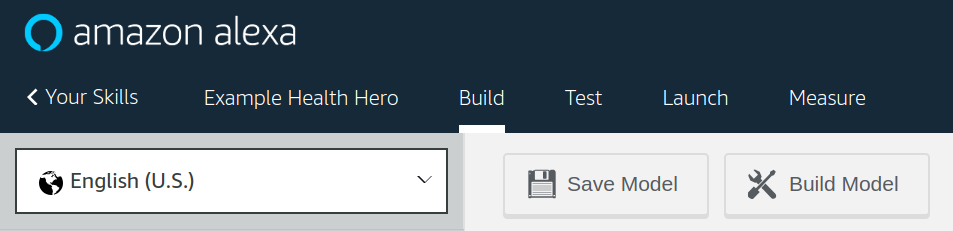

# [Example Alexa Ruby/Sinatra app](https://github.com/drhuffman12/example_alexa_ruby_sinatra)

Back to the main [README](../README.md).

## Alexa Skill Setup
----

### Log into your Alexa Dev account and add a skill.

https://developer.amazon.com/alexa

### Configuration

Under the "Build" tab for the skill, configure it with the following porperties

```yml
skill:
  - name: "Example Health Hero"
  - invocation_name: "example health hero"
  - type: "Custom"
  - endpoint:
    - type: "HTTPS"
    - regions:
        - default_region:
        - url: "https://23216bb0.ngrok.io"
        - cert_option: "My development endpoint is a sub-domain that ..."
  - intents:
    - name: "LogMovement"
    - utterances:
      - utterance: "log my movement"
```

See below example screenshots:

- [1.skill_name.png](screenshots/alexa_skill_setup/1.skill_name.png)
  - 
- [2.invocation_name.png](screenshots/alexa_skill_setup/2.invocation_name.png)
  - 
- [3.add_intent_and_name_it.png](screenshots/alexa_skill_setup/3.add_intent_and_name_it.png)
  - 
- [4.utterance_text.png](screenshots/alexa_skill_setup/4.utterance_text.png)
  - 
- [5.configure_endpoint.png](screenshots/alexa_skill_setup/5.configure_endpoint.png)
  - 
- [6.save_and_build_the_model.png](screenshots/alexa_skill_setup/6.save_and_build_the_model.png)
  - 
