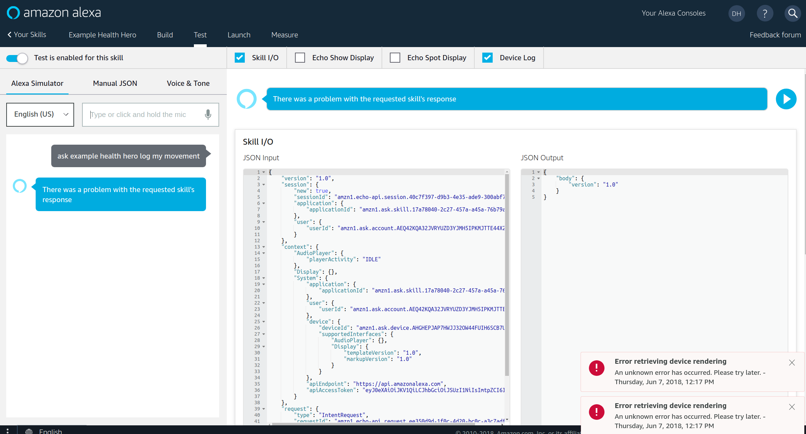
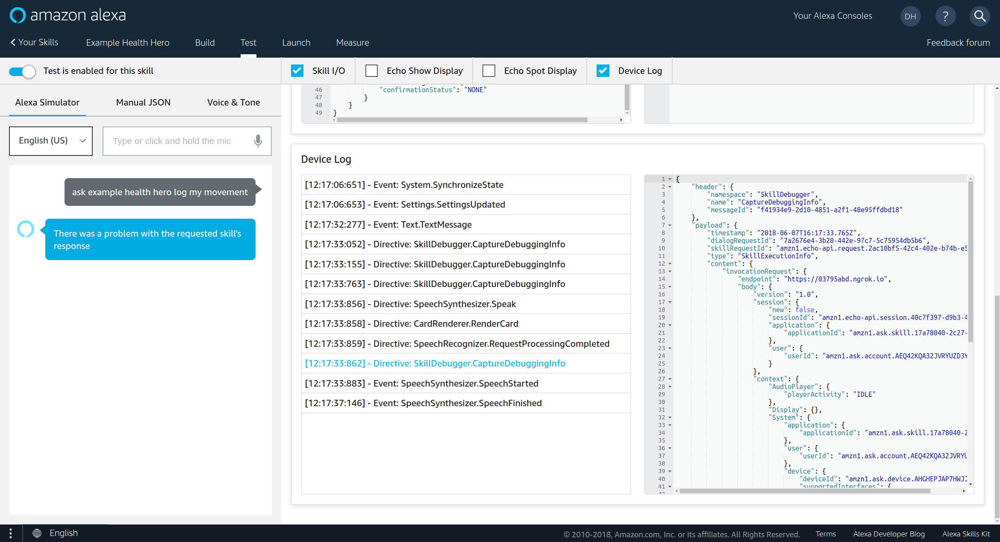

# [Example Alexa Ruby/Sinatra app](https://github.com/drhuffman12/example_alexa_ruby_sinatra)

Back to the main [README](../README.md).

## Alexa Skill Testing
----

### Log into your Alexa Dev account and add a skill.

https://developer.amazon.com/alexa

### Alexa Simulator

Under the "Test" tab, go to the "Alexa Simulator" sub-tab and do the following:

- Select the language of your choice
- Click into the text box
- Make a request to Alexa in this format (or type the following and press enter): `ask <skill-name> <intent-utterance>`
  - e.g.: `ask example health hero log my movement`

  - Alexa should respond with something like:
    - "You have moved eight steps. (Check in the `Device Log`. Click on `<timestamp> - Directive: SpeechSynthesizer.Speak` and view the details.)

      - [2.a.example_success.png](screenshots/alexa_skill_testing/2.a.example_success.png)
        -  

      - [2.b.directive_speach_synthesizer_speak.png](screenshots/alexa_skill_testing/2.b.directive_speach_synthesizer_speak.png)
        -  

      - [2.c.server_response_snippet.png](screenshots/alexa_skill_testing/2.c.server_response_snippet.png)
        -  

  - If there is a problem, Alexa might respond with one of the below common problem responses. (Check in the `Device Log`. Click on `<timestamp> - Directive: SkillDebugger.CaptureError` or `<timestamp> - Directive: SkillDebugger.CaptureDebuggingInfo` and view the details.)

    - `There was a problem with the requested skill's response`
      - if your skill is configured properly and your request to Alexa was: `ask Example Health Hero log my movement`, but the response in your sinatra is not yet set up as Alexa is expecting

      - [1.a.example_error.png](screenshots/alexa_skill_testing/1.a.example_error.png)
        - 
      - [1.b.directive_skill_debugger_capture_error.png](screenshots/alexa_skill_testing/1.b.directive_skill_debugger_capture_error.png)
        - 
      - [1.c.server_response_snippet.png](screenshots/alexa_skill_testing/1.c.server_response_snippet.png)
        - 

    - `<Audio only response>`
      - if it didn't understand at all
        - e.g.: if your request to Alexa was something like: `foo bar`

    - `Sorry, I'm not sure.`
      - if it didn't understand at all
        - e.g.: if your request to Alexa was something like: `ask foo bar`
